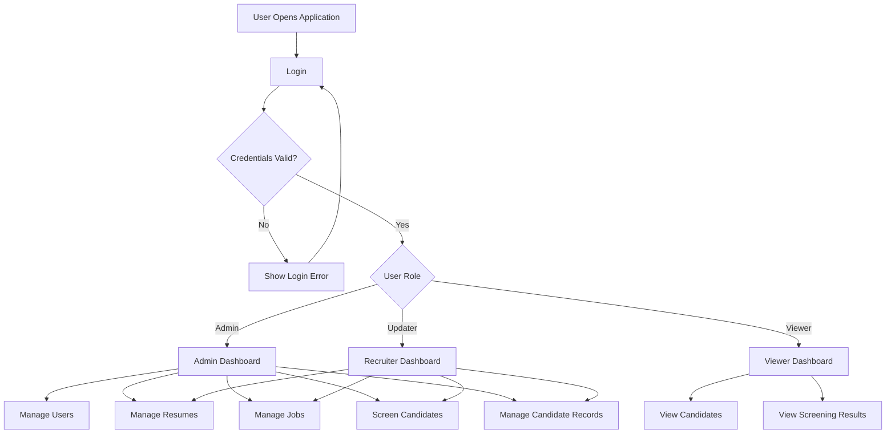
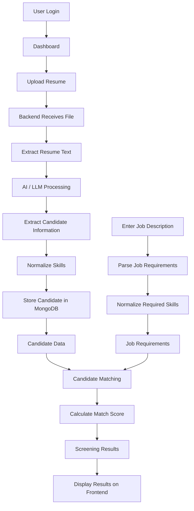
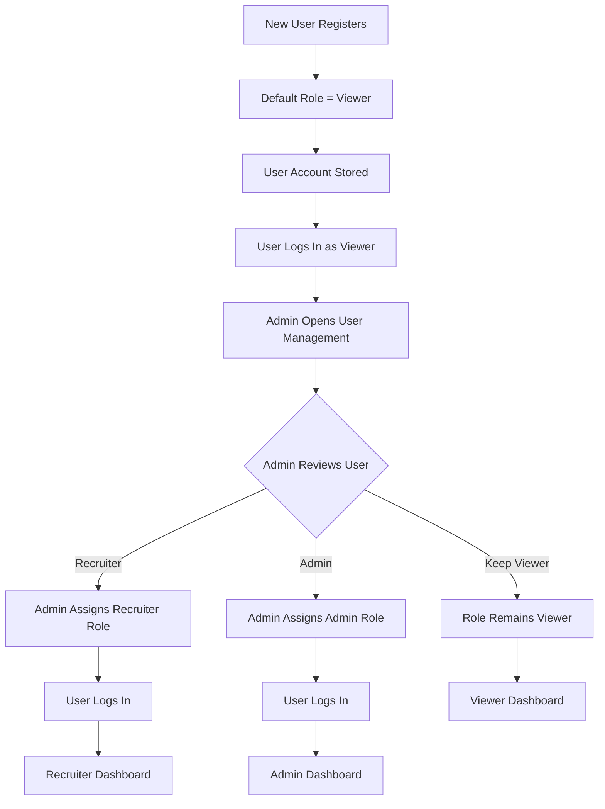
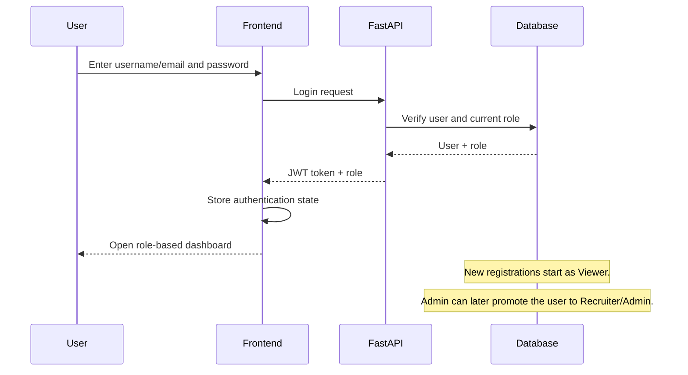

# Smart Resume Screener

A full-stack AI-powered resume screening and candidate management system
that helps recruiters and administrators upload resumes, extract
candidate information, compare candidates with a job description,
calculate matching scores, and manage candidate records through
role-based access.

------------------------------------------------------------------------

## 📌 Project Overview

**Smart Resume Screener** is designed to reduce the manual effort
involved in shortlisting candidates.

The application allows an authorized user to:

-   Upload resumes in supported document formats.
-   Extract text from uploaded resumes.
-   Use an AI/LLM service to extract structured candidate information.
-   Parse and normalize skills.
-   Add a job description.
-   Compare candidate skills and information with the job requirements.
-   Generate a match score.
-   View screening results in a dashboard.
-   Search and filter candidates.
-   Manage candidate records according to the user's role.

The application follows a separate **frontend + backend architecture**.

------------------------------------------------------------------------

# 🚀 Main Features

## 1. Resume Upload

Users can upload candidate resumes through the frontend.

The backend:

1.  Receives the uploaded file.
2.  Extracts the resume text.
3.  Sends the extracted content to the AI/LLM service.
4.  Converts the AI response into structured candidate information.
5.  Normalizes skills.
6.  Stores the candidate information in MongoDB.

------------------------------------------------------------------------

## 2. AI Resume Information Extraction

The AI service extracts useful information such as:

-   Candidate name
-   Email
-   Phone number
-   Skills
-   Education
-   Experience
-   Projects
-   Certifications
-   Other relevant resume information

The extracted information is stored in a structured format so that it
can be displayed and searched easily.

------------------------------------------------------------------------

## 3. Job Description Processing

The recruiter/admin can provide a job description.

The system processes the job description and identifies important
requirements such as:

-   Required skills
-   Preferred skills
-   Experience
-   Qualifications
-   Job-related keywords

Skills are normalized before comparison so that similar skill names can
be handled consistently.

Example:

``` text
JavaScript
javascript
JS
```

can be normalized into a consistent representation where appropriate.

------------------------------------------------------------------------

## 4. Candidate Matching

The system compares candidate information with the job requirements.

A candidate's screening result can include:

-   Match score
-   Matching skills
-   Missing skills
-   Candidate information
-   Job requirements
-   Screening status

This helps recruiters quickly identify suitable candidates.

------------------------------------------------------------------------

## 5. Candidate Dashboard

The dashboard provides a centralized view of candidates.

Typical information includes:

  Field            Description
  ---------------- ------------------------------
  Candidate Name   Candidate's name
  Email            Candidate email
  Skills           Extracted skills
  Match Score      Candidate-job matching score
  Experience       Candidate experience
  Status           Screening/current status

------------------------------------------------------------------------

# 👥 User Roles

The system supports three main roles:

1.  **Admin**
2.  **Updater**
3.  **Viewer**

Role-based access ensures that users can only perform actions allowed by
their role.

------------------------------------------------------------------------

## 🔴 Admin

The Admin has the highest level of access.

### Admin can:

-   Login
-   View dashboard
-   Upload resumes
-   Add/update job descriptions
-   Screen candidates
-   View candidate information
-   Update candidate information
-   Delete candidate records
-   Manage users
-   Assign/update user roles
-   View screening results
-   Manage application data

### Admin Flow

``` text
Login
   ↓
Admin Authentication
   ↓
Admin Dashboard
   ↓
Manage Users / Resumes / Jobs / Candidates
   ↓
Perform CRUD Operations
   ↓
View Screening Results
```

------------------------------------------------------------------------

## 🟡 Recruiter

The Updater can work with candidate and screening information but does
not have complete administrative control.

### Recruiter can:

-   Login
-   View dashboard
-   Upload resumes
-   Add/update candidate information
-   Add/update job descriptions
-   Run screening
-   View screening results
-   Update candidate status/details

### Recruiter cannot:

-   Manage administrator accounts
-   Change system-level permissions
-   Perform restricted user-management operations
-   Delete protected system data unless explicitly permitted

### Recruiter Flow

``` text
Login
   ↓
Recruiter Authentication
   ↓
Recruiter Dashboard
   ↓
Upload / Update Resume
   ↓
Process Candidate
   ↓
Run Screening
   ↓
View / Update Results
```

------------------------------------------------------------------------

## 🟢 Viewer

The Viewer has read-only access.

### Viewer can:

-   Login
-   View dashboard
-   View candidates
-   View resumes/candidate information
-   View job descriptions
-   View screening results
-   Search/filter available information

### Viewer cannot:

-   Upload resumes
-   Modify candidate information
-   Delete candidates
-   Manage users
-   Change roles
-   Modify job descriptions
-   Perform administrative operations

### Viewer Flow

``` text
Login
   ↓
Viewer Authentication
   ↓
Viewer Dashboard
   ↓
View Candidates
   ↓
View Screening Results
   ↓
Search / Filter
```

------------------------------------------------------------------------

# 🔐 Role-Based Access Flow



------------------------------------------------------------------------

# 📄 Complete Resume Screening Flow

The main workflow of the application is:



------------------------------------------------------------------------

# 🏗️ System Architecture

``` text
┌──────────────────────────────────────┐
│             Frontend                 │
│        React + JavaScript            │
│                                      │
│  Login                               │
│  Dashboard                           │
│  Resume Upload                       │
│  Job Description                     │
│  Candidate Table/Card                │
│  Screening Results                   │
└─────────────────┬────────────────────┘
                  │
                  │ REST API
                  ▼
┌──────────────────────────────────────┐
│              Backend                 │
│              FastAPI                 │
│                                      │
│  Authentication                      │
│  Resume Routes                       │
│  Candidate Management                │
│  Job Parsing                         │
│  Resume Extraction                   │
│  AI/LLM Service                      │
└─────────────────┬────────────────────┘
                  │
        ┌─────────┴─────────┐
        ▼                   ▼
┌───────────────┐   ┌─────────────────┐
│   MongoDB     │   │   AI / LLM API  │
│               │   │                 │
│ Candidates    │   │ Resume Analysis │
│ Users         │   │ Information     │
│ Jobs          │   │ Extraction      │
└───────────────┘   └─────────────────┘
```

------------------------------------------------------------------------

# 📁 Project Structure

``` text
smart-resume-screener/
│
├── backend/
│   │
│   ├── app/
│   │   ├── __init__.py
│   │   ├── main.py
│   │   │
│   │   ├── database.py
│   │   │
│   │   ├── routes/
│   │   │   ├── __init__.py
│   │   │   ├── auth_routes.py
│   │   │   ├── resume_routes.py
│   │   │   ├── candidate_routes.py
│   │   │   └── job_routes.py
│   │   │
│   │   ├── services/
│   │   │   ├── file_extractor.py
│   │   │   ├── llm_service.py
│   │   │   └── job_parser.py
│   │   │
│   │   ├── models/
│   │   │   └── ...
│   │   │
│   │   └── utils/
│   │       └── ...
│   │
│   ├── .env.example
│   ├── requirements.txt
│   └── Dockerfile
│
├── frontend/
│   │
│   ├── public/
│   │   └── ...
│   │
│   ├── src/
│   │   │
│   │   ├── components/
│   │   │   ├── Navbar.jsx
│   │   │   ├── Sidebar.jsx
│   │   │   ├── ResumeUpload.jsx
│   │   │   ├── JobDescription.jsx
│   │   │   ├── CandidateTable.jsx
│   │   │   ├── CandidateCard.jsx
│   │   │   └── MatchScore.jsx
│   │   │
│   │   ├── pages/
│   │   │   ├── Login.jsx
│   │   │   ├── Dashboard.jsx
│   │   │   ├── ScreeningResults.jsx
│   │   │   └── ...
│   │   │
│   │   ├── services/
│   │   │   └── ...
│   │   │
│   │   ├── App.jsx
│   │   └── main.jsx
│   │
│   ├── package.json
│   └── ...
│
├── README.md
└── .gitignore
```

> The exact files can vary as the project evolves. The structure above
> represents the main organization of the application.

------------------------------------------------------------------------

# 🛠️ Technology Stack

## Frontend

-   React.js
-   JavaScript
-   HTML
-   CSS
-   Axios
-   React Router
-   Tailwind CSS / project UI styling

## Backend

-   Python
-   FastAPI
-   Uvicorn
-   REST APIs

## Database

-   MongoDB

## AI / NLP

-   LLM-based resume information extraction
-   Gemini API or another configured LLM provider
-   Skill normalization and job-description parsing

## Authentication

-   JWT-based authentication
-   Role-based authorization

## Deployment

The project can be deployed using:

-   Vercel for frontend
-   Render or another backend hosting service
-   MongoDB Atlas for cloud database

------------------------------------------------------------------------

# 🔄 Backend Processing Flow

## Resume Processing

``` text
POST /resume/upload
        ↓
UploadFile
        ↓
extract_resume_text()
        ↓
extract_resume_information()
        ↓
normalize_skills()
        ↓
candidate_profile
        ↓
MongoDB
```

The important backend services include:

### `file_extractor.py`

Responsible for extracting readable text from uploaded resume files.

### `llm_service.py`

Responsible for sending resume text to the configured AI/LLM service and
obtaining structured candidate information.

### `job_parser.py`

Responsible for processing job descriptions and normalizing skills.

### `resume_routes.py`

Responsible for receiving resumes and coordinating the resume-processing
workflow.

### `database.py`

Responsible for database connection and MongoDB collections.

### `main.py`

The main FastAPI application entry point. It initializes the application
and registers the required routes/middleware.

------------------------------------------------------------------------

# 🔑 Environment Variables

Create a `.env` file inside the backend directory.

Example:

``` env
MONGODB_URL=your_mongodb_connection_string
DATABASE_NAME=smart_resume_screener

GEMINI_API_KEY=your_gemini_api_key

JWT_SECRET_KEY=your_generated_secret_key

FRONTEND_URL=http://localhost:3000
```

## Important Security Rule

Never commit real secrets to GitHub.

Do not upload:

``` text
.env
```

if it contains real API keys, passwords, database credentials, or JWT
secrets.

Instead, commit:

``` text
.env.example
```

with placeholder values.

Example:

``` env
GEMINI_API_KEY=your_gemini_api_key
JWT_SECRET_KEY=your_generated_secret_key
MONGODB_URL=your_mongodb_connection_string
```

------------------------------------------------------------------------

# 💻 Installation

## 1. Clone the Repository

``` bash
git clone <your-github-repository-url>
cd smart-resume-screener
```

------------------------------------------------------------------------

# ⚙️ Backend Setup

Go to the backend:

``` bash
cd backend
```

Create a virtual environment:

``` bash
python -m venv venv
```

Activate it on Windows:

``` bash
venv\Scripts\activate
```

Install dependencies:

``` bash
pip install -r requirements.txt
```

Create `.env` and add the required environment variables.

Start the FastAPI server:

``` bash
uvicorn app.main:app --reload
```

The backend will normally be available at:

``` text
http://127.0.0.1:8000
```

FastAPI documentation:

``` text
http://127.0.0.1:8000/docs
```

------------------------------------------------------------------------

# 🎨 Frontend Setup

Open another terminal.

Go to the frontend:

``` bash
cd frontend
```

Install dependencies:

``` bash
npm install
```

Start the development server:

``` bash
npm start
```

The frontend will normally run at:

``` text
http://localhost:3000
```

------------------------------------------------------------------------

# 🔌 API Flow

The frontend communicates with the backend using REST APIs.

General flow:

``` text
React Frontend
      ↓
Axios / HTTP Request
      ↓
FastAPI Route
      ↓
Service Layer
      ↓
MongoDB / AI Service
      ↓
FastAPI Response
      ↓
React UI
```

------------------------------------------------------------------------

# 📝 Registration and Login Flow

The application follows a **default Viewer registration model**.

When a new user registers, the system does **not** immediately give the user Recruiter or Admin permissions.

### Registration Flow

```text
New User
   ↓
Registration Page
   ↓
Enter Name / Email / Password
   ↓
Submit Registration
   ↓
Backend Validates Details
   ↓
Create User Account
   ↓
Default Role = VIEWER
   ↓
Account Stored in Database
   ↓
User Can Login as Viewer
```

### Important Role Rule

Every newly registered user is automatically assigned the **Viewer** role.

```text
New Registration
       ↓
Default Role
       ↓
    VIEWER
```

A normal user **cannot select Admin or Recruiter during registration**. This prevents users from giving themselves higher permissions.

---

## 👨‍💼 Admin Role Approval Flow

After registration, the Admin can review registered users and decide whether the user should remain a Viewer or be given a higher role.



### Admin checks the registered user

The Admin can review information such as:

- Name
- Email
- Registration details
- Current role
- Account status
- Other information required by the application

The Admin then decides:

```text
Is this user a recruiter?
        ↓
      YES ─────→ Assign RECRUITER
        │
       NO
        ↓
Keep VIEWER
```

If the Admin has permission to create/manage other administrators, the Admin can also assign the **ADMIN** role to an authorized user.

### Role Change

```text
Viewer
  │
  ├── Admin keeps role ─────→ Viewer
  │
  ├── Admin approves ───────→ Recruiter
  │
  └── Authorized Admin ─────→ Admin
```

The role stored in the database controls which dashboard and operations the user can access after login.

---

## 🔑 Complete Registration → Login → Role-Based Dashboard Flow

```text
                    NEW USER
                       │
                       ▼
                 REGISTRATION
                       │
                       ▼
             Account Created
                       │
                       ▼
             DEFAULT ROLE:
                  VIEWER
                       │
                       ▼
                    LOGIN
                       │
                       ▼
              VIEWER DASHBOARD
                       │
                       ▼
              ADMIN REVIEWS USER
                       │
             ┌─────────┴─────────┐
             │                   │
             ▼                   ▼
        KEEP VIEWER        CHANGE ROLE
             │                   │
             │          ┌────────┴────────┐
             │          │                 │
             │          ▼                 ▼
             │      RECRUITER           ADMIN
             │          │                 │
             ▼          ▼                 ▼
          VIEWER    RECRUITER           ADMIN
         DASHBOARD  DASHBOARD          DASHBOARD
```

### Example

Suppose a new employee registers:

```text
Name: Rahul
Email: rahul@example.com
Password: ********
```

The system creates:

```text
Name: Rahul
Role: Viewer
Status: Active
```

Rahul can initially use only Viewer features.

Later, the Admin checks Rahul's account and determines that Rahul is a recruiter.

The Admin changes:

```text
Viewer → Recruiter
```

When Rahul logs in again, the application loads the Recruiter dashboard and allows the recruiter-level operations.

---

## 🔒 Why the Default Viewer Role Is Important

Defaulting every new registration to Viewer provides an important security layer.

It prevents a new user from registering with:

```text
role = admin
```

or

```text
role = recruiter
```

and immediately receiving privileged access.

The secure approach is:

```text
Registration
     ↓
Viewer by default
     ↓
Admin review
     ↓
Role promotion if required
```

---

# 🔐 Authentication Flow



Every protected request should verify the user's authentication and
authorization before allowing the operation.

------------------------------------------------------------------------

# 🧑‍💼 Admin Workflow

``` text
Admin Login
     ↓
Authentication
     ↓
Admin Dashboard
     ↓
┌───────────────────────────────┐
│ Manage Users                  │
│ Manage Resumes                │
│ Manage Jobs                   │
│ Manage Candidates             │
│ Run Screening                 │
│ View Results                  │
└───────────────────────────────┘
     ↓
Logout
```

------------------------------------------------------------------------

# ✏️ Recruiter Workflow

``` text
Recruiter Login
      ↓
Authentication
      ↓
Recruiter Dashboard
      ↓
Upload Resume / Update Data
      ↓
Resume Processing
      ↓
AI Information Extraction
      ↓
Skill Normalization
      ↓
Candidate Database
      ↓
Run Screening
      ↓
Update Candidate Status
      ↓
Logout
```

------------------------------------------------------------------------

# 👁️ Viewer Workflow

``` text
Viewer Login
      ↓
Authentication
      ↓
Viewer Dashboard
      ↓
View Candidates
      ↓
View Job Information
      ↓
View Match Scores
      ↓
Search / Filter
      ↓
Logout
```

------------------------------------------------------------------------

# 📊 Candidate Screening Workflow

``` text
Candidate Resume
       ↓
Upload
       ↓
Text Extraction
       ↓
AI Information Extraction
       ↓
Candidate Profile
       ↓
Skill Normalization
       ↓
Store Candidate
       ↓
Job Description
       ↓
Job Skill Extraction
       ↓
Skill Normalization
       ↓
Candidate ↔ Job Comparison
       ↓
Match Score
       ↓
Screening Results
```

------------------------------------------------------------------------

# 🧠 Skill Normalization

Skill normalization improves the quality of candidate matching.

For example:

``` text
Input:
Java Script
Javascript
JS

Normalized:
javascript
```

Another example:

``` text
Input:
Machine Learning
machine-learning
ML

Normalized:
machine learning
```

This makes candidate and job skills easier to compare.

------------------------------------------------------------------------

# 📈 Screening Result

A screening result can contain information such as:

``` text
Candidate:
John Doe

Required Skills:
Python
FastAPI
MongoDB
React

Candidate Skills:
Python
FastAPI
React

Matching Skills:
Python
FastAPI
React

Missing Skills:
MongoDB

Match Score:
75%
```

The frontend displays the result in an easy-to-understand format.

------------------------------------------------------------------------

# 🖥️ Frontend Pages

## Login Page

Used for user authentication.

``` text
Email / Username
Password
Login
```

After authentication, the user is redirected according to their role.

------------------------------------------------------------------------

## Dashboard

The dashboard provides:

-   Candidate overview
-   Screening information
-   Match scores
-   Candidate statistics
-   Navigation options based on role

------------------------------------------------------------------------

## Resume Upload

Allows authorized users to:

-   Select resume files
-   Upload resumes
-   Start processing
-   View processing results

------------------------------------------------------------------------

## Job Description

Allows authorized users to enter or manage a job description.

The description is processed to identify relevant requirements and
skills.

------------------------------------------------------------------------

## Candidate Table

Displays candidate information in a structured table.

Possible operations include:

-   View
-   Search
-   Filter
-   Update
-   Delete, depending on role

------------------------------------------------------------------------

## Screening Results

Displays:

-   Candidate details
-   Match score
-   Matching skills
-   Missing skills
-   Screening information

------------------------------------------------------------------------

# 🗄️ Database

MongoDB is used to store application data.

Typical collections may include:

``` text
users
candidates
jobs
screening_results
```

## Candidate Data

A candidate record can contain:

``` json
{
  "name": "Candidate Name",
  "email": "candidate@example.com",
  "skills": [
    "python",
    "react",
    "mongodb"
  ],
  "education": [],
  "experience": [],
  "projects": []
}
```

------------------------------------------------------------------------

# 🔒 Security

The application should follow these security practices:

-   Use JWT authentication.
-   Apply role-based authorization.
-   Store secrets in environment variables.
-   Never expose API keys in frontend code.
-   Never commit `.env` files containing secrets.
-   Validate uploaded files.
-   Validate API inputs.
-   Restrict protected API routes.
-   Use HTTPS in production.
-   Use secure database credentials.
-   Configure CORS carefully.

------------------------------------------------------------------------

# 🌐 Production Architecture

A possible production setup:

``` text
                         Internet
                            │
             ┌──────────────┴──────────────┐
             │                             │
             ▼                             ▼
       Vercel Frontend                Render Backend
          React                           FastAPI
             │                             │
             └──────────────┬──────────────┘
                            │
                            ▼
                     MongoDB Atlas
                            │
                            ▼
                       AI / LLM API
```

------------------------------------------------------------------------

# 🚀 Deployment

## Frontend

The React frontend can be deployed on Vercel.

Before deployment, configure the production backend API URL in the
frontend environment configuration.

Example:

``` env
REACT_APP_API_URL=https://your-backend-url
```

The exact variable name should match the one used by the frontend code.

------------------------------------------------------------------------

## Backend

The FastAPI backend can be deployed on Render or another
Python-compatible hosting platform.

Typical start command:

``` bash
uvicorn app.main:app --host 0.0.0.0 --port $PORT
```

Configure all required environment variables in the hosting platform.

------------------------------------------------------------------------

## Database

MongoDB Atlas can be used as the production database.

The backend should connect using the MongoDB connection string stored in
an environment variable.

------------------------------------------------------------------------

# 🔁 Git Workflow

After making changes:

``` bash
git status
```

Add changes:

``` bash
git add .
```

Commit:

``` bash
git commit -m "Update Smart Resume Screener"
```

Push:

``` bash
git push origin main
```

Check the repository status:

``` bash
git status
```

------------------------------------------------------------------------

# 🧪 Testing Checklist

Before deployment, verify:

-   [ ] User can login.
-   [ ] Correct role is assigned after login.
-   [ ] Admin dashboard works.
-   [ ] Updater dashboard works.
-   [ ] Viewer dashboard works.
-   [ ] Viewer cannot modify protected data.
-   [ ] Resume upload works.
-   [ ] Resume text extraction works.
-   [ ] AI extraction works.
-   [ ] Skills are normalized.
-   [ ] Candidate information is stored.
-   [ ] Job description processing works.
-   [ ] Candidate matching works.
-   [ ] Match score is displayed.
-   [ ] Candidate search works.
-   [ ] Candidate filtering works.
-   [ ] Protected routes reject unauthorized users.
-   [ ] Environment variables are configured.
-   [ ] Production frontend can communicate with the backend.
-   [ ] Production backend can communicate with MongoDB.

------------------------------------------------------------------------

# 🐛 Common Problems

## Backend does not start

Check:

``` bash
python --version
pip --version
```

Then install dependencies:

``` bash
pip install -r requirements.txt
```

------------------------------------------------------------------------

## Frontend does not start

Run:

``` bash
npm install
npm start
```

------------------------------------------------------------------------

## MongoDB connection error

Check:

-   MongoDB URL
-   Database name
-   MongoDB Atlas network access
-   Database username
-   Database password

------------------------------------------------------------------------

## AI API error

Check:

-   API key
-   Environment variable name
-   API provider configuration
-   API quota
-   Backend `.env`

------------------------------------------------------------------------

## CORS error

Check that the backend allows requests from the frontend's URL.

For local development, the frontend and backend URLs must be configured
correctly.

------------------------------------------------------------------------

# 📌 Recommended Development Order

``` text
1. Setup Backend
       ↓
2. Configure MongoDB
       ↓
3. Configure AI API
       ↓
4. Setup Authentication
       ↓
5. Setup Role-Based Access
       ↓
6. Implement Resume Upload
       ↓
7. Implement Resume Text Extraction
       ↓
8. Implement AI Information Extraction
       ↓
9. Implement Skill Normalization
       ↓
10. Store Candidate Data
       ↓
11. Implement Job Description Processing
       ↓
12. Implement Candidate Matching
       ↓
13. Build Screening Results
       ↓
14. Connect Frontend APIs
       ↓
15. Test Admin / Recruiter / Viewer
       ↓
16. Deploy Backend
       ↓
17. Deploy Frontend
```

------------------------------------------------------------------------

# 🎯 Project Objective

The main objective of **Smart Resume Screener** is to make the
recruitment screening process faster and more organized by combining:

``` text
Resume Upload
      +
AI Information Extraction
      +
Skill Normalization
      +
Job Description Analysis
      +
Candidate Matching
      +
Role-Based Access
      =
Smart Resume Screening System
```

------------------------------------------------------------------------

# 🔮 Future Enhancements

Possible future improvements include:

-   Advanced candidate ranking.
-   More accurate semantic matching.
-   Resume ranking based on multiple criteria.
-   Email notifications.
-   Interview scheduling.
-   Candidate status pipeline.
-   Analytics dashboard.
-   Export screening results.
-   Bulk resume upload.
-   Advanced search.
-   Audit logs.
-   More granular permissions.
-   Multiple job openings.
-   Candidate comparison.
-   Improved AI explanations for match scores.

------------------------------------------------------------------------

# 👨‍💻 Project Structure Summary

``` text
                    SMART RESUME SCREENER
                              │
              ┌───────────────┴───────────────┐
              │                               │
           FRONTEND                        BACKEND
            React                         FastAPI
              │                               │
       ┌──────┼──────┐                 ┌──────┼──────┐
       │      │      │                 │      │      │
     Login  Upload  Results          Routes Services Database
       │      │      │                 │      │      │
       └──────┼──────┘                 └──────┼──────┘
              │                               │
              └───────────────┬───────────────┘
                              │
                         MongoDB
                              │
                         AI / LLM
```

------------------------------------------------------------------------

# 📜 License

This project is developed for educational, academic, and project
demonstration purposes.

If you add a formal open-source license, replace this section with the
selected license text.

------------------------------------------------------------------------

# ⭐ Conclusion

Smart Resume Screener provides an end-to-end workflow for AI-assisted
recruitment screening.

The system combines:

-   React frontend
-   FastAPI backend
-   MongoDB database
-   AI/LLM-based resume extraction
-   Job-description processing
-   Skill normalization
-   Candidate matching
-   Match-score generation
-   Role-based access control

The three main user flows are:

``` text
ADMIN
Login → Dashboard → Manage Users → Approve/Assign Role → Screen → Results

RECRUITER
Login → Dashboard → Upload/Update → Screen → Results

VIEWER
Login → Dashboard → View → Search/Filter → Results
```

This architecture provides a clear separation between presentation,
backend processing, AI services, database storage, and user permissions.
